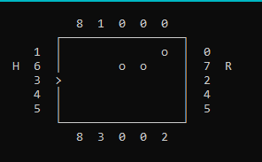

# Black Box Game
Simple project written as an assignment job. It implements Black Box Game in C++ Console. It has simple interface and 3 difficulty levels  

## Controls
WASD - move  
Space - Shoot Beam  
U/R - Undo/Redo Action
O - Mark Atom  
H - Help  
K - End Level  
Q - Quit/Pause  
## About Game
Your task is to properly mark all atoms on the board. Your beam can reflect on some circumstances or hit an atom, which will be marked on the border.  
Each shot is numbered and shown on the border of the board. The game mechanic is implemented with [Wikipedia's rules](https://en.wikipedia.org/wiki/Black_Box_(game))  
## Further Development
Not planned

