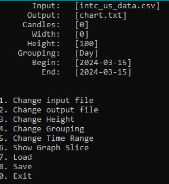
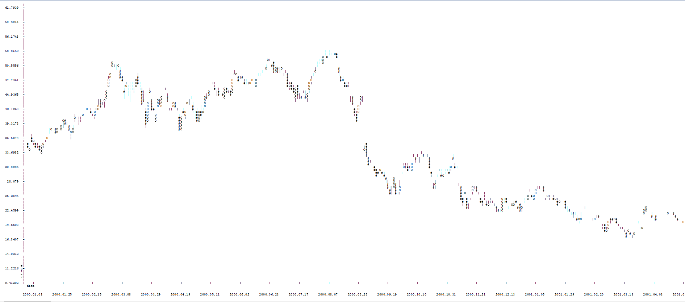

# Candle Stick Graph Generator
Project written as an assignment job. Its purpose is to generate candle stick charts in txt file using real world data from CSV files  

## How to use it?
Simple. Choose your options from menu and then choose "Generate Chart".  
Just do not generate to little graph, the minimum i reccomend is 50  
**Please Remember to previously load file before creating graph**  
**Also please remember to open your graph file in wordpad with no line breaks rather in notepad**
## Meaning of symbols
O - Rising Candle  
\# - Decreasing Candle  
| - Shadow  

## Features
- Ability to generate graph from given time range and given height  
- Ability to group by: Day, Week, Month
- Graph is automatically scaled to fit given width and height
- Generate graph in given time range
- Show graph slice in console  
- Scale on the border
- Logger is logging all activity to programlog.log
## Further development
You can use this algorithm and generate graph using any graphics library  
I do not plan any further development
