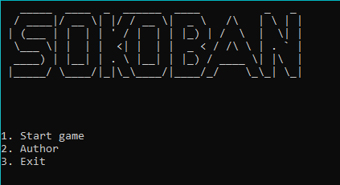
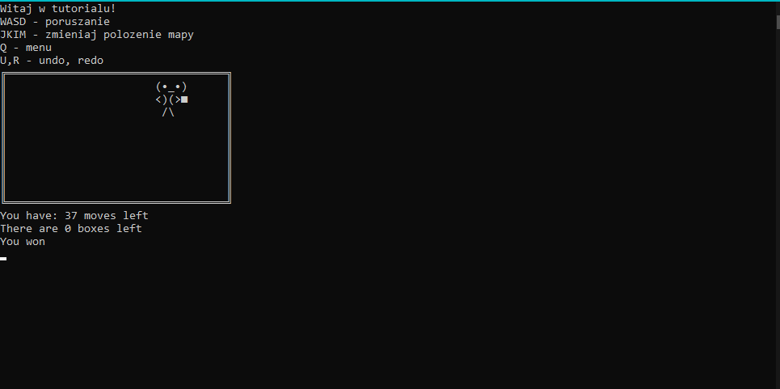
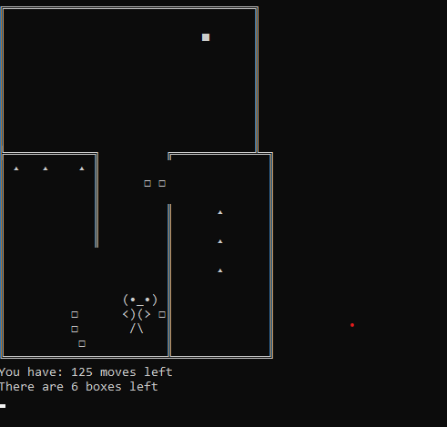

# Sokoban
This project was written as college assignment. The goal was to write our own implementation of Sokoban game in C++. The game has got text graphics implemented.

  

## Implementation
This game uses simple game loop, which performs rendering after proper input. Game is very simple in its implementation, except few things:  
+ Undo / Redo Actions - Custom stack was written to keep track of past actions. It is not efficient as I keep in memory the whole game. Better solution could be found, but drawbacks of this are not noticeable in this simple game
+ Model Loading - Custom class to load 2D text models has been written. It has ability to automatically load collision points, so there is no need to provide them in file
+ Collision recurrency. This allows to multiple boxes be moved, thus upgrading the gameplay by this little tactical feature

## Further Development
Further development is not planned. Game is perfectly playable and new maps can be easily added in Game.h file (sokobanLevels). That was pretty good experience in writing simple games from scratch, as
rendering had to be implemented, model loading and simple collision
